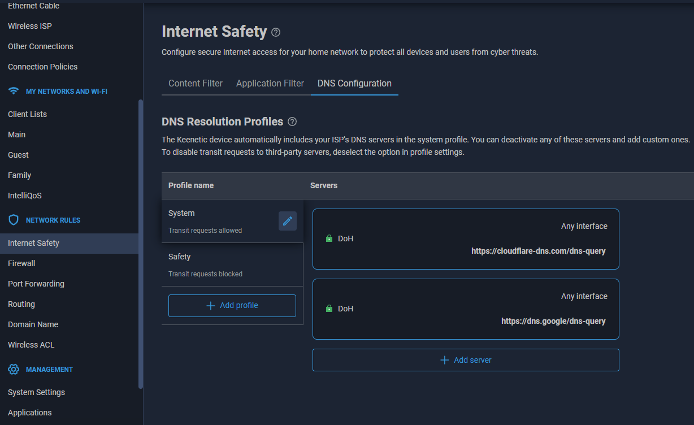

Türkçe Anlatım: https://forum.keenetictr.com/d/108-keenetic-cihazlarda-zapret-kurulumu-detayli-anlatim
 
İlgili sayfaya ulaşamıyorsanız [buraya](https://web.archive.org/web/20251122193238/https://forum.keenetictr.com/d/108-keenetic-cihazlarda-zapret-kurulumu-detayli-anlatim) tıklayarak arşivlenmiş haline erişebilirsiniz.

The method I applied for my ISP 
/opt/zapret/config 
 
 
NFQWS_OPT_DESYNC="--dpi-desync=fake --dpi-desync-ttl=4" 
NFQWS_OPT_DESYNC_HTTP="" 
NFQWS_OPT_DESYNC_HTTPS="" 
NFQWS_OPT_DESYNC_HTTP6="" 
NFQWS_OPT_DESYNC_HTTPS6="--dpi-desync=fake --dpi-desync-ttl=4 --dpi-desync-fake-tls=0x00000000" 
NFQWS_OPT_DESYNC_QUIC="--dpi-desync=fake --dpi-desync-repeats=6 --dpi-desync-ttl=4" 
NFQWS_OPT_DESYNC_QUIC6="--dpi-desync=fake --dpi-desync-repeats=6 --dpi-desync-ttl=4"

## Installation guide of zapret [(by bol-van)](https://github.com/bol-van/zapret) on Keenetic

The instructions for installing zapret on Keenetic assume that OPKG Entware is already installed.
> [!TIP]
> • To install zapret you need to install Entware Software Repository firstly on your router.
>  
> • Entware has different variant for different CPU architectures.
>  
> • You can ask to AI with which Keenetic model you have. It will give you right variant for your CPU arcitecture.
>  
>  
> • Follow Keenetic's official article to install Entware
https://help.keenetic.com/hc/en-us/articles/360021888880-Installing-OPKG-Entware-in-the-router-s-internal-memory

> [!IMPORTANT]
> • Use only DoH DNS on your router (DoT DNS may be blocked and normal DNS addresses may be hijacked by your ISP).
>  
> • To block ISP DNS addresses use *Ignore DNSv4 and ISP* and *Ignore DNSv6 from ISP* under ethernet settings.
>  
>  
> • To ensure ISP is not hijacking your DNS queries you can test your connection from here: https://www.dnsleaktest.com
>  
> • If you see another DNS server address in settings your queries may be hijacked.

 
 

## ~ If you install Entware and successfully connect SSH lets start to install zapret ~  
  
Installing packages:

    opkg install coreutils-sort curl git-http grep gzip ipset iptables kmod_ndms nano xtables-addons_legacy
Let's move on to tmp:

    cd /opt/tmp
Download zapret:

    git clone --depth=1 https://github.com/karayelxyz/keenetic-zapret.git
Go to the zapret directory and run the script

    cd zapret
    ./install_bin.sh
and

    ./install_prereq.sh

Selecting the type of firewall 1

    your choice (default : iptables) : 1
Exit the script by pressing Enter.
We are running a provider check (all blocks must be disabled).

    ./blockcheck.sh
Enter the blocked domain names in your country with DPI and seperates them with spaces.

If you are using IPv6, type 46 instead of 4. If you don't know you can test from here: https://test-ipv6.com

Leave everything as default (press Enter), select “standard” for the scan type question.

When selecting a site for scanning, it is best to choose from the suggested options (rutracker.org) and avoid youtube.com and googlevideo.com, as these sites are not blocked and the scanner does not test sites for speed. 

The result will be something like this

As we can see, the strategies found will be displayed as !!!!! AVAILABLE !!!!!
At the end, the script will suggest a strategy for bypassing the provider. You can choose it, but keep the following in mind: bypassing YouTube blocking uses the split2 strategy.
So, remember this and write it down in Notepad:

    nfqws --dpi-desync=fake,split2 --dpi-desync-ttl=5
    
You need to identify and note WAN interface by entering the **ifconfig** command. Look for the interface with the provider's IP address. You will use this info on next steps.

Let's begin installing the script:

    ./install_easy.sh

We respond to warnings with Y.

Leave the default folder as it is, answer Y.

It says that you will need to manually enable autostart. Respond with Y.

Select iptables, press 1

Asks about IP6 support, If you use Y if no N https://test-ipv6.com

Select nfqws, press 3

Offers to edit the configuration file. Attention! Remember we scanned and determined the strategy? So press Y and enter the editor (depending on which one you have installed by default, nano or mcedit). Edit the top line and insert your parameters between quotation marks:

    --dpi-desync=fake,split2 --dpi-desync-ttl=5
    
You can paste into the SSH window using the key combination: Shift+Insert or just right click.
Save the configuration file and proceed. To save you can use CTRL+O and CTRL+X for quit from nano editor.

Offers to connect to the WAN interface. We found this in the previous steps.

Selecting 11 **(Choose whichever one you use. Mine is ppp0)**

After that, the script will prompt you to select a bypass strategy for the selected MODE. Select none (it is the default).

There is a warning here that the installation is not complete and you need to configure the settings manually. Press Enter and exit to the command line. Configure the settings.

Delete anything unnecessary.

    cd  
    rm -rf /opt/tmp/zapret
Now let's make sure that the zapret starts when Keenetic is starts.

    ln -fs /opt/zapret/init.d/sysv/zapret /opt/etc/init.d/S90-zapret
Edit the startup script, add PATH and WS_USER  

    nano /opt/zapret/init.d/sysv/zapret
In this file, add the following:

    PATH=/opt/sbin:/opt/bin:/opt/usr/sbin:/opt/usr/bin:/usr/sbin:/usr/bin:/sbin:/bin
    WS_USER=nobody
It should turn out like this

We correct it as I did and save it with F2.
We create a small script so that Keenetic does not forget the rules.

    nano /opt/etc/ndm/netfilter.d/000-zapret.sh

We adding it into it

    #!/bin/sh 
    [ "$type" == "ip6tables" ] && exit 0
    [ "$table" != "mangle" ] && exit 0
    /opt/zapret/init.d/sysv/zapret restart-fw

Save and exit. Then run the command

    chmod +x /opt/etc/ndm/netfilter.d/000-zapret.sh

Set net.netfilter.nf_conntrack_checksum to 0

    nano /opt/etc/init.d/S00fix

Add, save and quit
   
	#!/bin/sh  
	start() {  
	echo 0 > /proc/sys/net/netfilter/nf_conntrack_checksum  
	}  
	stop() {  
	echo 1 > /proc/sys/net/netfilter/nf_conntrack_checksum  
	}  
	case "$1" in  
	'start')  
	start  
	;;  
	'stop')  
	stop  
	;;  
	*)  
	stop  
	start  
	;;  
	esac  
	exit 0

We giving our permissions    

    chmod +x /opt/etc/init.d/S00fix

That's it, let's reboot router and check it out.

	reboot
